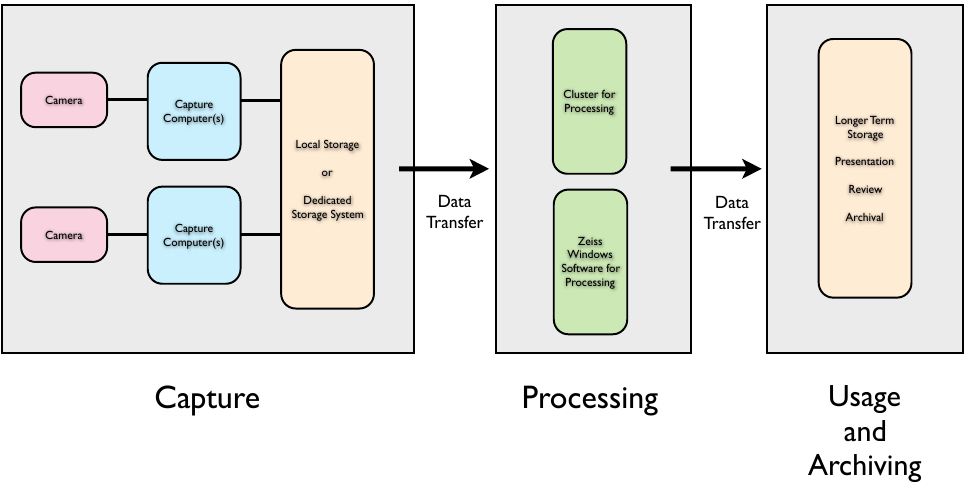
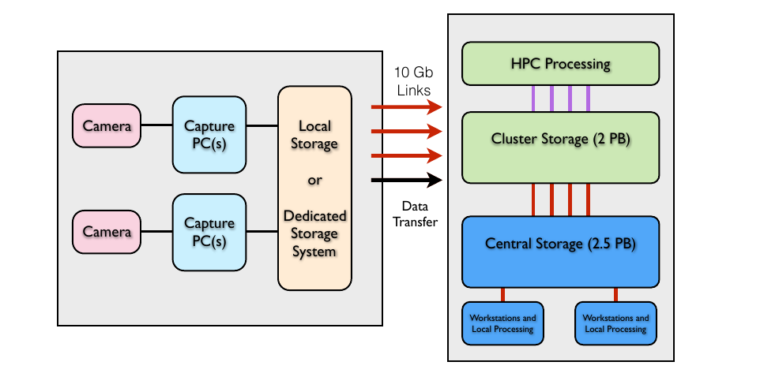
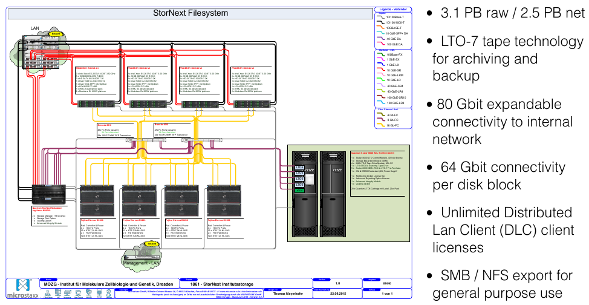
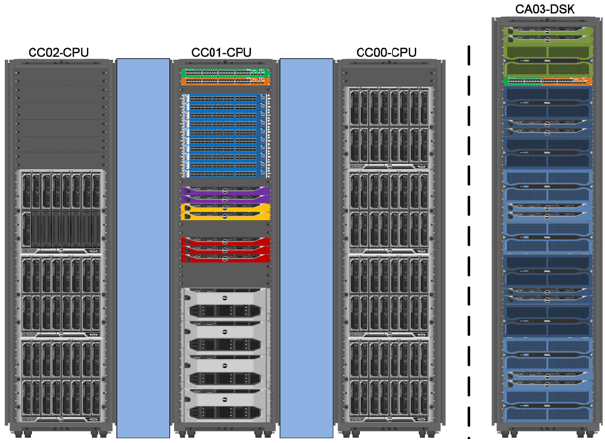

# Max Planck Institute of Molecular Cell Biology and Genetics (MPI CBG)

## The Institute

[columns,class="row vertical-align"]

[column,class="col-xs-8"]

  
*Scientific Software Engineer* at Max Planck Institute of Molecular Cell Biology and Genetics

[/column]

[column,class="col-xs-4"]

* Dresden, Germany
* 500 staff
* founded 2001
* cell biology
* genomics
* systems biology

[/column]

[/columns]

## Outline

1. SPIM@CBG : overview and history

2. Automation & Reduction

3. Present and Future

# CBG and SPIM

## 2012

{ width=80% }  
used by Huisken Lab

## 2016

{ width=75% }  
used by *Huisken Lab*, *Myers Lab*, Tomancak Lab, LMF

## Commercial vs. Custom SPIM?

|         | Commercial SPIM | Experimental SPIM |
|---------|-----------------|-------------------|
| MB/s    |             300 |              1600 |
| TB/day  |              26 |               138 |
| TB/week |             182 |               966 |
|         |                 |                   |
| 2014/TB |             200 |               200 |
| 2016/TB |            2100 |              2100 |

<!-- . . .    -->

<!-- <br\> -->
<!-- <br\> -->

<!-- [columns,class="row"] -->

<!-- [column,class="col-xs-6"] -->

<!-- - in 2014: HPC storage was 200 TB only -->

<!-- [/column] -->

<!-- [column,class="col-xs-6"] -->

<!-- - LHC run 1 averaged 1 GB/s   -->
<!-- (all experiments) -->
<!-- - LHC run 2is expected to yield 6 GB/s  -->

<!-- [/column] -->

<!-- [/columns] -->

## Central Storage 

{ width=90% }  

## HPC

[columns,class="row vertical-align"]

[column,class="col-xs-8"]

{ width=90% }  

[/column]

[column,class="col-xs-4"]

- 5 + 1 racks in off-campus data center
- 3632 cores in 132 nodes
- 23 nodes with 2 GPUs each
- 2.1 PB usable lustre storage
- IB FDR interconnect

[/column]

[/columns]
