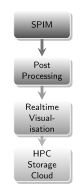

# Max Planck Institute of Molecular Cell Biology and Genetics (MPI CBG)

## The Institute

[columns,class="row vertical-align"]

[column,class="col-xs-8"]

  
*Scientific Software Engineer* at Max Planck Institute of Molecular Cell Biology and Genetics

[/column]

[column,class="col-xs-4"]

* Dresden, Germany
* 500 staff
* founded 2001
* cell biology
* genomics
* systems biology

[/column]

[/columns]

## Outline

1. SPIM@CBG : overview and history

2. Automation, Reduction and more

3. Present and Future

# SPIM@CBG

## 2012/2013

{ width=80% }  
used by Huisken Lab

## 2016

{ width=75% }  
used by *Huisken Lab*, *Myers Lab*, Tomancak Lab, LMF

## Data Rates

|                | Commercial SPIM | Custom SPIM |                        LHC Run 1 |
|---------------:|----------------:|------------:|---------------------------------:|
| MB/s           |             300 |        1600 |                             1000 |
| TB/day         |              26 |         138 |                               86 |
| TB/week        |             182 |         966 |                              602 |
| **Storage/TB** |        **2500** |    **2500** |                     **303 154**  |
|                |             CBG |         CBG | [WLCG](http://wlcg.web.cern.ch/) |

## Central Storage 

{ width=90% }  

## HPC

[columns,class="row vertical-align"]

[column,class="col-xs-8"]

{ width=90% }  

[/column]

[column,class="col-xs-4"]

- 5 + 1 racks in off-campus data center
- 3632 cores in 132 nodes
- 23 nodes with 2 GPUs each
- 2.1 PB usable lustre storage
- IB FDR interconnect

[/column]

[/columns]

# Automation, Reduction and more

## Top level view

[columns,class="row vertical-align"]

[column,class="col-xs-6"]

{ width=40% }  

[/column]

[column,class="col-xs-6"]

- aquisition on the microscope  
&nbsp;
- quality control  
(can happen on the scope)  
&nbsp;
- processing on HPC infrastructure  
(fusion, deconvolution)  
&nbsp;
- storage for downstream analysis (publication)

[/column]

[/columns]

## Automate Transfer?

[columns,class="row vertical-align"]

[column,class="col-xs-8"]

{ width=85% }  

[/column]

[column,class="col-xs-4"]

- idea: monitor directory on aquisition host and apply rule based data transfers

- master thesis at TU Dresden in 2014/2015 comparing 

- results from ramdisk to ramdisk promising only (for [iRODS](https://irods.org/))

- downstream transparency of [iRODS](https://irods.org/) unclear 

- [UNICORE](https://www.unicore.eu/) not yet there

[/column]

[/columns]

## Automated Parallel Pipeline

[columns,class="row vertical-align"]

[column,class="col-xs-6"]

{ width=70% }  

[/column]

[column,class="col-xs-6"]

- publication by [Schmied et al., 2016](https://academic.oup.com/bioinformatics/article/32/7/1112/1744153/An-automated-workflow-for-parallel-processing-of)

- express individual steps as direct acyclic graph in [snakemake](https://snakemake.readthedocs.io/en/stable/)

- running [Fiji](fiji.sc) in headless mode challenging

- parameter interface through [Fiji](fiji.sc) macros very time consuming

- portable and scalable parallel execution

- replaced a large pile of shell scripts

[/column]

[/columns]

## Training 

[columns,class="row vertical-align"]

[column,class="col-xs-6"]

{ width=80% }

[/column]

[column,class="col-xs-6"]

- knowledge is key when data becomes large

- rolled out [software carpentry](www.software-carpentry.org) style course curriculum  
( topics: bash, git, python, R, HPC )

- extremely positive feedback and high demand

[/column]

[/columns]

&nbsp;

**Trained scientists are happy scientists!**

# Present and Future

## Automated Transfers! { data-background-image="img/DARPA_Big_Data_shaded.png" }

- ingest GUI on the PCs that aquire the data

- obtain meta data during ingest (user interaction on the scope)

- backend is unclear (iRODS, gridFTP, Lustre client, ...)

- challenge: **Stay Flexible!**

## The Future

[columns,class="row vertical-align"]

[column,class="col-xs-6"]

{ width=40% }  

[/column]

[column,class="col-xs-6"]

- Aquisition of deconvolved & compressed stacks at the source  
&nbsp;
- Post-Processing to enhance resolution  
&nbsp;
- Realtime Visualisation (holo deck)  
&nbsp;
- Downstream analysis or storage or cloud based sharing or ..

[/column]

[/columns]

# Summary

## SPIM is here to stay

- SPIM microscopes are capable of produce unprecedented amounts of data (wrt potential and size)

- MPI CBG SPIM community is actively solving inherent problems (deconvolution, lack of resolution, compression, data management, ...)

- Good infrastructure (software/hardware) is key to high scientific discovery rate

&nbsp;

**Thank you for your attention!**

